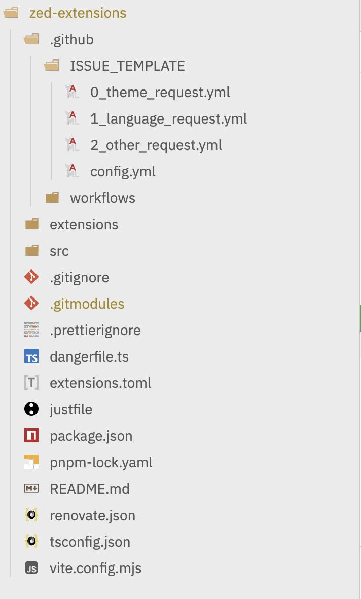
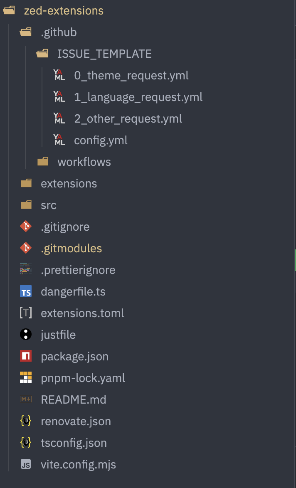

# Zed Modern Icons

**Modern, theme-aware SVG icon set for the Zed editor.**
This package provides a clean and minimal icon system for file types and technologies, optimized for light and dark themes.

## ✨ Features

- 📁 File-type and tech stack icons (e.g. JS, TS, Rust, Python, HTML, CSS, etc.)
- 🌗 Automatically adapts to Zed's light and dark themes
- 🧩 Easy integration into Zed extensions or custom UI elements
- 🎨 Pixel-perfect vector design

## 📁 File Naming Convention

Each icon has two variants:

- `file_type_light_{{TYPE}}.svg` — for light theme
- `file_type_{{TYPE}}.dark.svg` — for dark theme

Use the appropriate one based on the current theme.

## 📸 Previews

## 🛠️ Integration Tip

Zed supports detecting the current theme dynamically. You can use that to switch between `*light_{{TYPE}}.svg` and `*_{{TYPE}}.svg` icons at runtime.

## 📜 License

[GNU General Public License v3.0](LICENSE)

---

**Made with ❤️ for the Zed community by [@badrat-in](https://github.com/badrat-in)**
