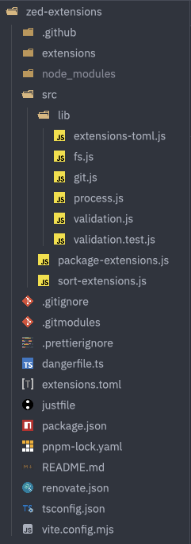

# Zed Modern Icons

**Modern, theme-aware SVG icon set for the Zed editor.**
This package provides a clean and minimal icon system for file types and technologies, optimized for light and dark themes.

## ✨ Features

- 📁 File-type and tech stack icons (e.g. JS, TS, Rust, Python, HTML, CSS, etc.)
- 🌗 Automatically adapts to Zed's light and dark themes
- 🧩 Easy integration into Zed extensions or custom UI elements
- 🎨 Pixel-perfect vector design

## 📁 File Naming Convention

Each icon has two variants:

- `file_type_light_{{TYPE}}.svg` — for light theme
- `file_type_{{TYPE}}.dark.svg` — for dark theme

Use the appropriate one based on the current theme.

## 📸 Previews




## 🌓 Automatic Theme Detection

This extension is theme-aware, but Zed doesn't automatically switch between the light and dark themes by default. You'll need to manually select the appropriate theme ("Modern Icons (Light)" or "Modern Icons (Dark)") when you change Zed's theme.

For automatic theme switching based on your system's appearance, you can add the following configuration to your Zed `settings.json` file. This will sync both your Zed UI theme and the icon theme with your system settings.

```json
{
  "theme": {
    "mode": "system",
    "light": "Your Light Theme Name",
    "dark": "Your Dark Theme Name"
  },
  "icon_theme": {
    "mode": "system",
    "light": "Modern Icons (Light)",
    "dark": "Modern Icons (Dark)"
  }
}
```
*(Replace `"Your Light Theme Name"` and `"Your Dark Theme Name"` with the names of your preferred themes.)*

## 🛠️ Integration Tip

Zed supports detecting the current theme dynamically. You can use that to switch between `*light_{{TYPE}}.svg` and `*_{{TYPE}}.svg` icons at runtime.

## 📜 License

[GNU General Public License v3.0](LICENSE)

---

**Made with ❤️ for the Zed community by [@badrat-in](https://github.com/badrat-in)**
