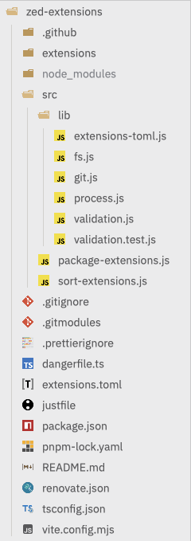

# Zed Modern Icons

[](LICENSE)
[](ICONS_LICENSE)
[](extension.toml)
[](https://github.com/RKInnovate/zed-modern-icons)
[](https://github.com/RKInnovate/zed-modern-icons/issues)

**Modern, theme-aware SVG icon set for the Zed editor.**

This package provides a clean and minimal icon system for file types and technologies, optimized for light and dark themes.

## ✨ Features

- 📁 File-type and tech stack icons (e.g. JS, TS, Rust, Python, HTML, CSS, etc.)
- 🌗 Automatically adapts to Zed's light and dark themes
- 🧩 Easy integration into Zed extensions or custom UI elements
- 🎨 Pixel-perfect vector design

## 📁 File Naming Convention

Each icon has two variants:

- `file_type_light_{{TYPE}}.svg` — for light theme
- `file_type_{{TYPE}}.dark.svg` — for dark theme

Use the appropriate one based on the current theme.

## 📦 Installation

1. Open Zed Editor
2. Press `cmd+shift+p` (macOS) or `ctrl+shift+p` (Linux/Windows)
3. Type "zed: extensions" and select it
4. Search for "Modern Icons Theme"
5. Click "Install"

Alternatively, you can install from the command line:
```bash
zed --install-extension modern-icons
```

## 📸 Previews




## 🌓 Automatic Theme Detection

This extension is theme-aware, but Zed doesn't automatically switch between the light and dark themes by default. You'll need to manually select the appropriate theme ("Modern Icons (Light)" or "Modern Icons (Dark)") when you change Zed's theme.

For automatic theme switching based on your system's appearance, you can add the following configuration to your Zed `settings.json` file. This will sync both your Zed UI theme and the icon theme with your system settings.

```json
{
  "theme": {
    "light": "Your Light Theme Name",
    "dark": "Your Dark Theme Name"
  },
  "icon_theme": {
    "light": "Modern Icons (Light)",
    "dark": "Modern Icons (Dark)"
  }
}
```

_(Replace `"Your Light Theme Name"` and `"Your Dark Theme Name"` with the names of your preferred themes.)_

## 🤝 Contributing

Contributions are welcome! Here's how you can help:

1. Fork the repository
2. Create a new branch (`git checkout -b feature/amazing-feature`)
3. Make your changes
4. Commit your changes (`git commit -m 'Add some amazing feature'`)
5. Push to the branch (`git push origin feature/amazing-feature`)
6. Open a Pull Request

Please ensure your PR:
- Follows the existing code structure
- Includes relevant icons for both light and dark themes
- Updates documentation if needed

## 🐛 Bug Reports & Feature Requests

Found a bug or have a feature request? Please [open an issue](https://github.com/RKInnovate/zed-modern-icons/issues) with:
- A clear description of the issue/request
- Steps to reproduce (for bugs)
- Expected vs actual behavior
- Screenshots if applicable

## 🙏 Acknowledgements

The icons used in this extension are sourced from the [VSCode Icons](https://github.com/vscode-icons/vscode-icons) project. The icons are licensed under the [Creative Commons Attribution-ShareAlike 4.0 International Public License](ICONS_LICENSE), and the original source code for the VSCode extension is licensed under the MIT license. We are grateful to the contributors of that project for their work.

## 📜 License

This project is dual-licensed:
- **Code**: [GNU General Public License v3.0](LICENSE)
- **Icons**: [Creative Commons Attribution-ShareAlike 4.0 International](ICONS_LICENSE)

## 💖 Support

If you find this extension useful, please consider:
- Starring this repository ⭐
- Sharing it with others
- [Opening issues](https://github.com/RKInnovate/zed-modern-icons/issues) for bugs or suggestions
- Contributing improvements via Pull Requests

---

**Made with ❤️ for the Zed community by [@badrat-in](https://github.com/badrat-in)**
